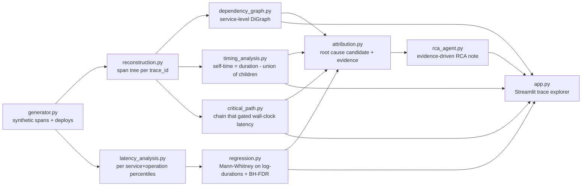

# Distributed Trace Intelligence — Latency Regression RCA

AI SRE hackathon MVP: ingests distributed traces, reconstructs the service
call tree, computes the critical path and self-time per span, detects
tail-latency regressions with multiple-testing control, and runs a
deterministic evidence-driven agent that writes a root-cause note carrying
the full chain from symptom to span.

## 1. Problem

A latency regression shows up at the edge (`checkout` getting slow) and every
team can point downstream without proof. Existing dashboards show aggregate
latency per service, which hides two things that matter most:

- **Which chain of spans actually caused the wall-clock delay** — summing
  span durations double-counts concurrent work.
- **Whether a service got slower itself, or is just waiting on something
  downstream** — a duration increase alone doesn't tell you that.

## 2. Why "sum of durations" and raw service-level percentiles are wrong

- Spans overlap when calls fan out (a service calling 3 dependencies at
  once). Summing their durations counts that overlapped time multiple times
  and will exceed the parent's own wall-clock duration.
- Mixing a 2ms cache-read span with a 400ms search span into one
  "service-level" percentile produces a number that describes neither
  endpoint. Percentiles are always computed per **(service, operation)**.
- Failed requests fail fast and have a different distribution shape; mixing
  them into the latency percentile drags P99 down and can mask a real
  regression. Errors are reported separately as an `error_rate`.

## 3. Solution — pipeline overview



## 4. Data schema

**Spans CSV** (`data/spans.csv`):
`trace_id, span_id, parent_span_id, service, operation, start_ns, duration_ns, status_code, attributes_json`

**Deploy events** (`data/deploys.csv`):
`ts, service, version`

## 5. Trace generation (`src/generator.py`)

- 12-service checkout call graph with real fan-out: `order-service` calls
  `payment-service`, `inventory-service`, and `recommendation-service`
  concurrently; `inventory-service` sequentially calls `product-service` then
  `database-service`.
- Lognormal service times (right-skewed, realistic).
- Two periods (BEFORE / AFTER) split by a deploy event
  (`inventory-service v2.4.1`).
- The regression is planted **only** in `database-service / inventory_lookup`:
  P99 ≈ 90ms (BEFORE) → P99 ≈ 500–800ms (AFTER). Every other service/operation
  stays statistically stable across the two periods, acting as the control
  group the FDR correction needs to be meaningful.
- Deliberately injected: a small rate of broken parent references (orphaned
  spans) and clock skew (child span appearing to start fractionally before
  its parent), so the reconstruction and self-time code has to handle real
  imperfections rather than assuming clean data.
- Background traffic on 5 unrelated services provides a realistic population
  of stable endpoints for the regression scan to test against.

Run: `python src/generator.py` — writes `data/spans.csv` and
`data/deploys.csv`, reproducible via a fixed random seed.

## 6. Span reconstruction (`src/reconstruction.py`)

Groups spans by `trace_id`, links children via `parent_span_id`, and finds
the root (null parent). A parent reference pointing at a span_id that
doesn't exist in the trace is tracked as an **orphan** (not a crash) and
re-attached under the trace's root so no data is silently dropped. If the
root itself is missing, the earliest-starting span is used as a fallback
root. Orphan/root-missing counts are surfaced as data-quality metrics on the
dashboard.

## 7. Dependency graph (`src/dependency_graph.py`)

A `networkx.DiGraph` built by walking every trace tree and adding an edge
`caller_service -> callee_service` per parent/child span pair (same-service
internal spans are skipped). Each node carries call count, mean/P95/P99
latency (ms) and error rate.

## 8. Self-time (`src/timing_analysis.py`)

```
self_time = span.duration - union(child_intervals)
```

**Union, not sum** — concurrent children overlap in wall-clock time, and
summing double-counts that overlap. Interval merging handles no children,
overlapping children, nested children, and adjacent intervals. Child
intervals are clipped to the parent's own bounds first, so clock skew
(a child appearing to start slightly before its parent) can't push self-time
negative.

This is the primary attribution signal: if a service's own self-time stayed
flat while its total span duration grew, it isn't doing more work — it's
waiting longer on something downstream.

## 9. Critical path (`src/critical_path.py`)

Starting at the root span, repeatedly step into whichever direct child
**finished last** (max `start + duration`) — that child is what gated how
soon the parent could finish. Recurse to a leaf. This is the chain that
actually determined the trace's end-to-end latency; summing all span
durations is the wrong measure because it double-counts the work that ran
concurrently and was already "hidden" inside the wall-clock time.

## 10. Regression detection (`src/regression.py`)

For every `(service, operation)`:

1. Log-transform BEFORE/AFTER durations (latency is right-skewed; the log
   transform is what makes the two-sample test behave).
2. Mann-Whitney U test on the log-durations (non-parametric, no normality
   assumption, works on independent samples).
3. **Benjamini-Hochberg FDR correction across every endpoint tested at
   once** — testing hundreds of endpoints simultaneously at raw p<0.05 would
   produce many false positives; BH controls the expected proportion of
   false discoveries at the target rate (default 5%).
4. `regression = statistically_significant AND practical P99 increase ≥ 20%`
   — a statistically-detectable-but-trivial wobble is not called a
   regression; both statistical and practical significance are required.

Endpoints with fewer than 5 samples in either period are skipped rather than
tested — not enough data for a meaningful comparison. Low-traffic endpoints
that do get tested (n<30) are flagged `low_confidence` in the latency-stats
table rather than treated as equally reliable as high-traffic ones. There is
no universal minimum trace count for a "meaningful" P99 — it depends on the
tail you're trying to resolve — so the system reports sample counts and a
confidence flag instead of pretending otherwise.

**Tail sampling**: this dataset is fully captured (no sampling), so the
percentiles above are exact for the synthetic population. If traces were
tail-sampled (e.g. only slow/error traces kept), the observed distribution
would be biased toward the tail the policy favors, inflating P99 estimates
and confounding a real regression with a sampling-policy change. The schema
carries no sampling metadata today, but the architecture (raw spans in,
stats computed downstream) would let a `sampling_rate` attribute be folded
into `latency_analysis.py` as an inverse-probability weight without changing
any other module.

## 11. Root-cause attribution & evidence chain (`src/attribution.py`)

Combines the regression result, critical-path membership rate (how often the
flagged operation appears on the critical path of AFTER-period traces), the
upstream caller's self-time ratio (low self-time on the caller ⇒ it's mostly
waiting on the callee, not slow itself), the dependency graph, and deploy
timing into one `root_cause_candidate` with an explicit evidence list and
call chain. Deliberately called a **candidate** — deployment proximity is
reported as a temporal coincidence and contributing signal, never proof of
causation.

## 12. RCA agent (`src/rca_agent.py`)

Deterministic template agent — no LLM required for the core demo — that
renders the structured attribution into a readable note with a confidence
label (HIGH / MEDIUM / LOW) based on how many independent evidence signals
line up (statistical significance, critical-path presence, deploy
correlation).

## 13. Dashboard (`app.py`)

Streamlit + Plotly + NetworkX, dark SRE-style layout:
system overview → service dependency graph (root cause highlighted) →
latency regression table → trace waterfall + critical path → root cause card
→ deployment timeline → trace explorer with service/operation/trace_id
filters.

## 14. Setup

```bash
python3 -m venv .venv && source .venv/bin/activate   # optional
pip install -r requirements.txt
```

## 15. Running instructions (clean machine)

```bash
python src/generator.py       # writes data/spans.csv, data/deploys.csv
python -m pytest              # 12 unit tests: self-time, critical path, FDR/regression
streamlit run app.py          # opens the dashboard at http://localhost:8501
```

`src/pipeline.py` can also be run directly to print the RCA note to stdout
without launching the dashboard: `PYTHONPATH=. python src/pipeline.py`.

## 16. Example output

```
Symptom:
api-gateway/checkout P99 increased from 231ms to 819ms.

Primary contributor (root cause candidate):
database-service / inventory_lookup

Evidence:
1. database-service/inventory_lookup P99 increased from 184ms to 779ms (323% increase).
2. Distribution shift is statistically significant after FDR correction (adjusted p=0.0000).
3. database-service/inventory_lookup appears on the critical path in 45% of sampled AFTER-period traces.
4. inventory-service (the direct caller of database-service) has an average self-time ratio of only 4%
   of its own span duration, indicating it mostly waits on database-service rather than doing its own slow work.
5. inventory-service v2.4.1 was deployed and temporally coincides with the regression onset.

Evidence chain:
api-gateway → order-service → inventory-service → database-service → Latency Regression

Confidence: MEDIUM
```

## 17. Note on storage format

The brief specifies Parquet for `spans`. This build uses CSV instead: on a
locked-down Windows machine, `pyarrow`'s compiled parquet engine was blocked
outright by an Application Control policy (`"An Application Control policy
has blocked this file"` on `_parquet`), with `fastparquet` unavailable as a
fallback for the same reason. CSV needs no compiled native extension, so the
pipeline runs anywhere pandas runs. The column schema, types, and every
downstream module (`reconstruction.py` through `rca_agent.py`) are
completely unchanged — only `pd.read_parquet`/`to_parquet` became
`pd.read_csv`/`to_csv` in `generator.py`, `pipeline.py`, and `otel_loader.py`.
Swapping back to Parquet on an unrestricted machine is a two-line change if
required for grading compliance.

## 18. Limitations

- Synthetic data only; a real deployment would need an OTLP ingestion
  adapter (the `opentelemetry-demo` schema maps cleanly onto the same
  `spans.csv` shape).
- Critical-path algorithm assumes clean parent/child temporal nesting after
  clock-skew clipping; extreme skew across hosts could still misorder a
  chain in principle.
- Attribution's "upstream service" heuristic is graph-frequency-based
  (mode of observed callers), not a guaranteed unique service topology.
- No persistent storage — designed to run as a single-machine batch/report
  tool, not a streaming ingestion service.

## 19. Future work

- Streaming ingestion (Kafka/OTLP collector) instead of a static CSV
  batch.
- Incorporate sampling-rate metadata into the percentile/regression
  calculations for tail-sampled production traces.
- Multi-hop attribution ranking (currently reports the single top
  regression; could rank/cluster several correlated regressions per
  incident).
- Optional LLM layer on top of `rca_agent.py`'s structured evidence for a
  more natural-language incident summary.
